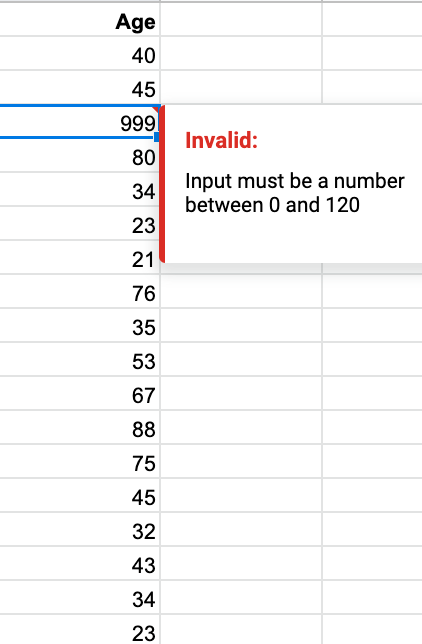
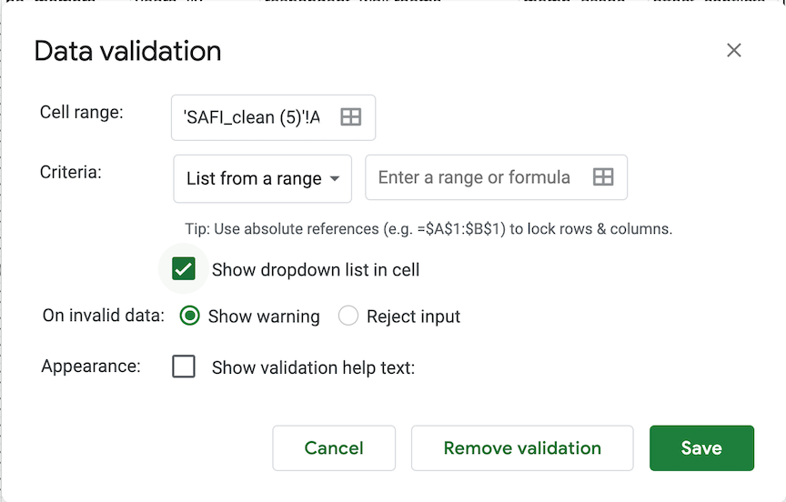

When you have a well-structured data table, you can use several simple
techniques within your spreadsheet to ensure the data you enter is
free of errors. 

## Spreadsheet Encoding

One issue you may encounter when dealing with Spreadsheets is files with different encoding. As with other text files, a CSV file has a character encoding that determines how characters are stored. The de facto standard today is to use Unicode (UTF-8), which supports all the alphabets of the world and lots of other characters like technical symbols and emojis. Unfortunately, Excel still exports CSV files using legacy character encodings like ASCII. If you select the wrong type of character encoding (often by double clicking on a .csv file and having excel automatically open it), you can have unreadable data, and even possible data corruption. To overcome these issues, Wwen you import a file into Google Sheets it automatically converts the contents to UTF-8, as are any downloaded sheets.

**FIXME ADD EXAMPLE**

## Validating data on input

When we input data into a cell of a spreadsheet we are typically not constrained in the type of data we enter.
In any one column, the spreadsheets software will not warn us if we start to enter a mix of text, numbers or dates in different rows.
Even if we are not facing constraints from the software, as a researcher we often anticipate that all data in one column will be of a certain type.
It is also possible that the nature of the data contained in the table allows us to place additional restrictions on the acceptable values for cells in a column. For example a column recording age in years should be numeric, greater than 0 and is unlikely to be greater than 120.

As Excel, Google Sheets allows us to specify data validations to be applied to cell contents.
If the validation fails, an error is raised and the data we entered does not go into the particular cell.
In addition to providing validation when we enter data, Google Sheets allows us to add validations to data that has already been entered.
The validation is not applied retrospectively, so that data are removed.
Instead, if a particular cell would fail the validation check a triangle is placed in the top left corner of the cell as a warning, as shown below:

We will be working with a couple of examples of data validation
rules but many others exist. For an overview of data validation options and rules
available in Google Sheets, check out the [support page on data validation](https://support.google.com/appsheet/answer/10107325?hl=en&ref_topic=10102053#:~:text=Data%20validation%20rules%20allow%20you,to%20constrain%20user%20entered%20values). 

We will look at two examples: 

1. Restricting data to a numeric range
2. Restricting data yo integers and integers within a range
3. Restricting data to entries from a list

### Restricting data to a numeric range

Looking again at the [clean version of the SAFI
dataset](https://ndownloader.figshare.com/files/11492171), we see that there are
several columns with numeric data. One example of this is the column `no_membrs`
representing the number of people in the household. We would assume that there are no families with greater than 30 members. Can can assure there won't be issues with data entry in this column?

1\. Select the `no_membrs` column.

2\. On the `Data` tab select and then `Data Validation`. The following popout will appear: 

3\. Select the `Number` for criteria and set the range.  Here we will choose a minimum of 1 and a maximum of 30.

Your data table will now not allow you to enter a value that violates
the data validation rule you have created. To test this out, try 
to enter a new value above 30 in one of the cells for this collumn and see what happens.

> ## Tip: Customizing warning messages
> While setting validation rules you can customize the resulting message to be more informative by entering
your own message by selecting to show validation help text in `Appearance`.
> You can also choose to let invalid data result in a warning rather than reject input, by selecting that option. Rejecting an input will result on an empty cell after a "there is a problem" warning.
{: .callout}

### Integers and integers within a range

We have covered data validation for simple number ranges, but what if we expect that a cell will only take integers or integers within a range?
Let's say we want to determine that we will only accept integers for the column `rooms`. How can we accomplish that? In Excel, we could choose from data validation options `whole number`, but this option is not available on Google Sheets. Still, we can apply this restriction using a conditional function:

1. Select the `rooms` column and then, `Data`, followed by `Data validation`;
2. Choose the custom formula option and type `=IF(G2=INT(G2),True,False)`;
3. Make sure you select the correct data range (starting from the first cell specificed in the formula) and save it.
 
This function is instructing Google Sheets to give you a test result if the G2 column has an integer number or not. If any decimal numbers are entered you will get a warning.

> ## Challenge
> How could you expand this formula to only consider integers within a specific range (e.g., 0-9 rooms)?
> 
{: .challenge}

> ## Exercise
> Apply a new data validation rule of your choice to one of the other numeric 
> columns in this data table. Discuss with the person sitting next
> to you what a reasonable rule would be for the column you've selected. Be sure to create an informative input message. 
{: .challenge}

### Restricting data to entries from a list

Quality assurance can make data entry easier as well as more robust. For
example, if you use a list of options to restrict data entry, the spreadsheet
will provide you with a drop-downlist of the available items. So, instead of
trying to remember how to spell "mabatisloping", or whether or not you capitalized "cement" you can select the
right option from the list.

1\. Select the `respondent_wall_type` column.

2\. On the `Data` tab select `Data Validation` and then choose "List of items`

3\. Type a list of all the values that you want to be accepted in this column, separated by a comma (with no spaces). For us this will be "grass, muddaub, burntbricks, sunbricks, cement". 

4\. Create a meaningful input message, then save it.

We have now provided a restriction that will be validated each time we try and
enter data into the selected cells. When a cell in this column is selected, a drop-down arrow will appear.
When you click the arrow, you will be able to select a value from your list.
If you type a value which is not on the list, you will get an error message. This not only prevents data input errors, but also makes it easier and faster to enter data. 

> ## Exercise
> Apply a new data validation rule to one of the other categorical 
> columns in this data table. Discuss with the person sitting next
> to you what a reasonable rule would be for the column you've selected. Be sure to create an informative input message. 
{: .challenge}

> ## Tip
> Typing a list of values where only a few possible values exist (like "grass, muddaub, burntbricks, sunbricks, cement") might be convenient, but if the list is longer it makes sense to create it as a small table (in a separate tab of the workbook).
> We can give the table a name and then reference the table name as the source of acceptable inputs when the source box appears in the Data Validation pop-out.
>
> Using a table in this way makes the data entry process more flexible.
> If you add or remove contents from the table, then these are immediately reflected in any new cell entries based on this source.
> You can also have different cells refer to the same table of acceptable inputs.
{: .callout}

> ## Tip
> 
> In the examples above we have applied data validation rules to
> an existing spreadsheet to demonstrate how they work, however, 
> you may have noticed that data validation rules are not applied
> retroactively to data that is already present in the cell. 
> This means, for example, that if we had already entered `150`
> in the `no_membrs` column before applying our data validation
> rule, that cell would not be flagged with a warning. 
> 
> When using spreadsheets for data entry, it is a good idea to set up
> data validation rules for each column when you set up your 
> spreadsheet (i.e. before you enter any data). 
{: .callout}

## Tracking Changes and Protecting Sheets and Cells from Changing

Google Sheets track changes don’t work like Google Docs which have a feature that displays all changes automatically. Instead, you have to track changes using a few other features. Google Sheets allow you to:

- See the history of changes for a cell.
- See the complete version history of the document.
- Set up different access permissions.
- Protect sheets or data ranges from changes.
- Set up to receive notifications when changes occur.

Most of these features however, will be only enabled if the spreadsheet is native, or if the file is saved as Google Sheets. This means that some of the functions won't work if you open a .xls or .csv file you have uploaded to your drive. So, make sure, to check whether under `File`, you have the option `Save as Google Sheets`. If so, make sure to save it. In the next episode we will learn how to transform the file to other formats. 

### Seeing the history of changes for a cell

If you wish to inspect updates within a cell you may select the cell, then right-click `show edit history`. The information regarding the last editing action will be displayed and you can use the arrows to navigate the all history of edits for that specific cell. 

### Seeing the complete version history of the document

You may also check version histories for the entire document by either clicking on the `Last edit` info displayed right next to `Help` on the top menu, or `File` then `Version History` and `See version histroy`. You can name versions to keep better track of the history. Note that this won't change the file name!

### Setting up different permissions

### Protecting Sheets and Ranges

### Setting up to get notifications about changes


